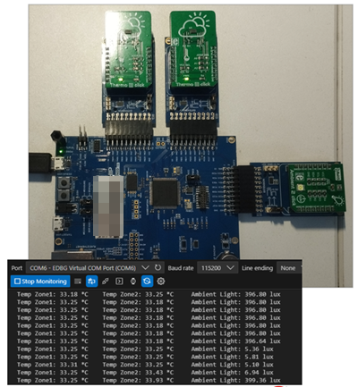
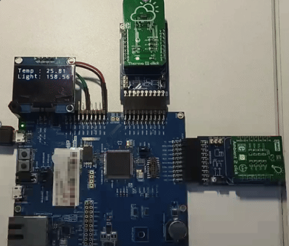
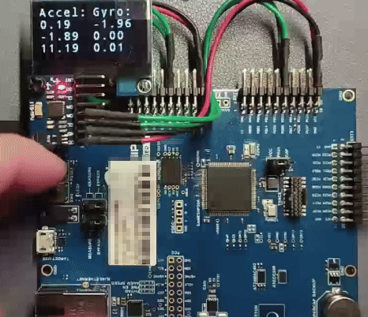

# zephyr-basic-sensor-test
Basic demos using sensor subsystem and drivers on SAME54

#### Software:

- Zephyr v4.1.0
- Zephyr SDK v0.17.0

#### Hardware:

- SAME54 XPRO
- Various Click boards (see below)

#### Demo:

##### temp_ambient  
- Drivers used: MCP9808, OPT3001   
  
##### sensor_display  
- Driver: MCP9808, OPT3001 (ambient light), SH1107 (OLED)  
  
##### motion_oled  
- Drivers used: MPU6050 (accel/ gyro), SH1107 (OLED)  
  

------